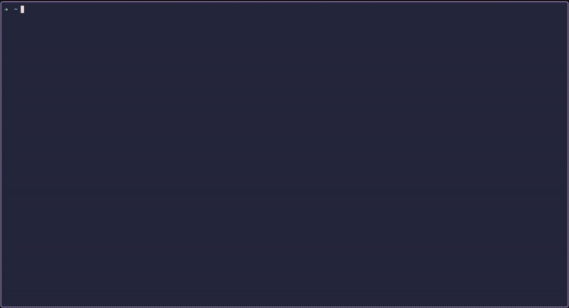

# Terminal Typing Test

A simple Terminal Typing Test utility written in Rust using ratatui, inspired by [Monkeytype](https://monkeytype.com/).



## Installation

```bash
git clone https://github.com/semanavasco/ttt.git
cd ttt
cargo install --path .
```

## Usage

```bash
$ ttt
A simple Terminal Typing Test utility.

Usage: ttt [OPTIONS] [COMMAND]

Commands:
  clock  Timer-based game mode
  words  Wourd-count-based game mode
  help   Print this message or the help of the given subcommand(s)

Options:
  -c, --config <CONFIG>  Read config from file
  -s, --save-config      Save config, applies overrides provided by other arguments
      --defaults         Use default settings
  -h, --help             Print help
  -V, --version          Print version
```

### Example Commands

```bash
# Run with saved config or defaults
$ ttt

# Run clock mode with 60 second duration
$ ttt clock -d 60

# Run words mode with 100 words using Spanish text
$ ttt words -c 100 -t spanish

# Save current settings as default
$ ttt clock -d 45 -t english --save-config

# Load from custom config file
$ ttt --config ~/my-config.toml
```

## Embedded Texts

| Name         | Description                             |
| ------------ | --------------------------------------- |
| `english`    | 100 most common English words (default) |
| `french`     | 100 most common French words            |
| `german`     | 100 most common German words            |
| `lorem`      | 100 words of Lorem Ipsum                |
| `portuguese` | 100 most common Portuguese words        |
| `spanish`    | 100 most common Spanish words           |
| `swedish`    | 100 most common Swedish words           |

## Configuration

Config file location: `~/.config/ttt/config.toml`

### Example Config

```toml
[defaults]
text = "english"
mode = "clock"
duration = 30
```

_CLI arguments override config file settings._

Custom texts can be placed at: `~/.config/ttt/texts/`

## Theming

You can customize the look of the application by adding a `[theme]` section to your `config.toml`.

### Style Syntax

Styles are defined as strings containing space-separated properties:

- **Foreground:** `fg:<color>` (e.g., `fg:red`, `fg:#ff0000`)
- **Background:** `bg:<color>` (e.g., `bg:blue`)
- **Underline Color:** `ul:<color>` (e.g., `ul:green`)
- **Modifiers:** `bold`, `italic`, `underlined`, `dim`, `reversed`, `hidden`, `crossed_out`

**Colors** can be specified as:

- **Named:** `black`, `red`, `green`, `yellow`, `blue`, `magenta`, `cyan`, `gray`, `dark_gray`, `white`, and their `light_` variants.
- **Hex:** `#RRGGBB`
- **Indexed:** `0`-`255` (ANSI color codes)

### Available Keys

| Key            | Description                                          | Default                          |
| -------------- | ---------------------------------------------------- | -------------------------------- |
| `border_type`  | Border style (`plain`, `rounded`, `double`, `thick`) | `rounded`                        |
| `border_style` | Style of the window borders                          | `reset`                          |
| `background`   | Global background color                              | `reset`                          |
| `default`      | Default text style                                   | `reset`                          |
| `pending`      | Future text to be typed                              | `fg:dark_gray`                   |
| `correct`      | Correctly typed text                                 | `fg:green bold`                  |
| `incorrect`    | Incorrectly typed text                               | `fg:red bold underlined`         |
| `skipped`      | Text skipped by backspacing too far or errors        | `fg:dark_gray underlined ul:red` |
| `cursor`       | The current character under the cursor               | `bg:white fg:dark_gray`          |
| `extra`        | Extra characters typed (errors)                      | `fg:red bold`                    |
| `selected`     | Selected option in menus                             | `fg:magenta bold`                |
| `editing`      | Option currently being edited                        | `fg:yellow bold underlined`      |

### Example Theme

```toml
[theme]
border_type = "double"
pending = "fg:gray"
correct = "fg:#a6da95"
incorrect = "fg:#ed8796 bold"
cursor = "bg:#f5bde6 fg:#24273a"
```

## Contributing

### Adding a New Game Mode

1. Create `src/app/modes/newmode.rs` and implement `Handler` + `Renderer` traits:

```rust
use crate::app::{
    events::Action,
    modes::{Direction, GameStats, Handler, OptionGroup, OptionItem, Renderer},
    ui::char::StyledChar,
};
use crate::config::Config;
use crossterm::event::KeyEvent;

pub struct NewMode {
    // your fields
}

impl Handler for NewMode {
    fn initialize(&mut self, config: &Config) { /* load config, generate words */ }

    fn handle_input(&mut self, key: KeyEvent) -> Action {
        // Handle typing, backspace, mode-specific shortcuts
        // Global keys (ESC, TAB, arrows, ...) are handled before this
        Action::None
    }

    fn reset(&mut self) { /* reset to initial state */ }

    fn is_complete(&self) -> bool { /* checks for game mode's completion */ }

    fn on_complete(&mut self) { /* called when transitioning to State::Complete */ }
}

impl Renderer for NewMode {
    fn get_options(&self, focused: Option<usize>) -> OptionGroup {
        // Return mode-specific options (e.g., duration, word count)
        OptionGroup { items: vec![] }
    }

    fn select_option(&mut self, index: usize) { /* handle option selection */ }

    fn adjust_option(&mut self, index: usize, direction: Direction) { /* adjust value */ }

    fn is_option_editing(&self) -> bool { /* whether an option is being edited */ }

    fn option_count(&self) -> usize { /* the amount of options available */ }

    fn get_progress(&self) -> String { /* string representation of the test's status (e.g., 35/50 words)*/ }

    fn get_characters(&self) -> Vec<StyledChar> {
        // Return characters with semantic states (Pending, Correct, Incorrect, etc.)
        // Global renderer applies theme colors
        vec![]
    }

    fn get_stats(&self) -> GameStats { GameStats::new(0.0, 0.0, 0.0) }

    fn get_wpm_data(&self) -> Vec<(f64, f64)> { vec![] }

    fn footer_hints(&self) -> Vec<(&'static str, &'static str)> {
        // Optional mode-specific key hints, e.g., vec![("Ctrl+H", "Clear word")]
        vec![]
    }
}
```

2. Add to `src/app/modes/mod.rs`:

```rust
pub mod newmode;

use crate::app::modes::newmode::NewMode;

// Add variant to Mode enum (derives Subcommand for CLI integration)
#[derive(Serialize, Deserialize, Subcommand, Display, EnumIter, VariantNames, Clone)]
#[serde(tag = "mode", rename_all = "lowercase")]
pub enum Mode {
    Clock { /* ... */ },
    Words { /* ... */ },
    NewMode {
        // your mode-specific config fields
    },
}

// Update create_mode factory
pub fn create_mode(mode: &Mode) -> Box<dyn GameMode> {
    match mode {
        // ...
        Mode::NewMode { /* ... */ } => Box::new(NewMode::new(/* ... */)),
    }
}

// Update Mode::default_for helper
impl Mode {
    pub fn default_for(name: &str) -> Self {
        match name {
            // ...
            "newmode" => Mode::NewMode { /* ... */ },
            _ => Mode::default(),
        }
    }
}
```

3. Open a PR with your new mode _(or enjoy it locally...)_!

## Feedback

This is one of my first Rust projects and I'm actively learning! I'm open to suggestions, code reviews, and constructive criticism. Feel free to open issues. I'd appreciate if you'd let me fix them rather than opening PRs with written solutions. Thank you!

## License

This project is licensed under the MIT License - see the [LICENSE](LICENSE) file for details.
